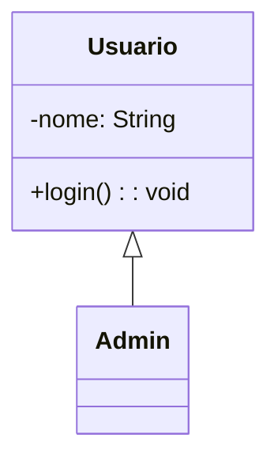
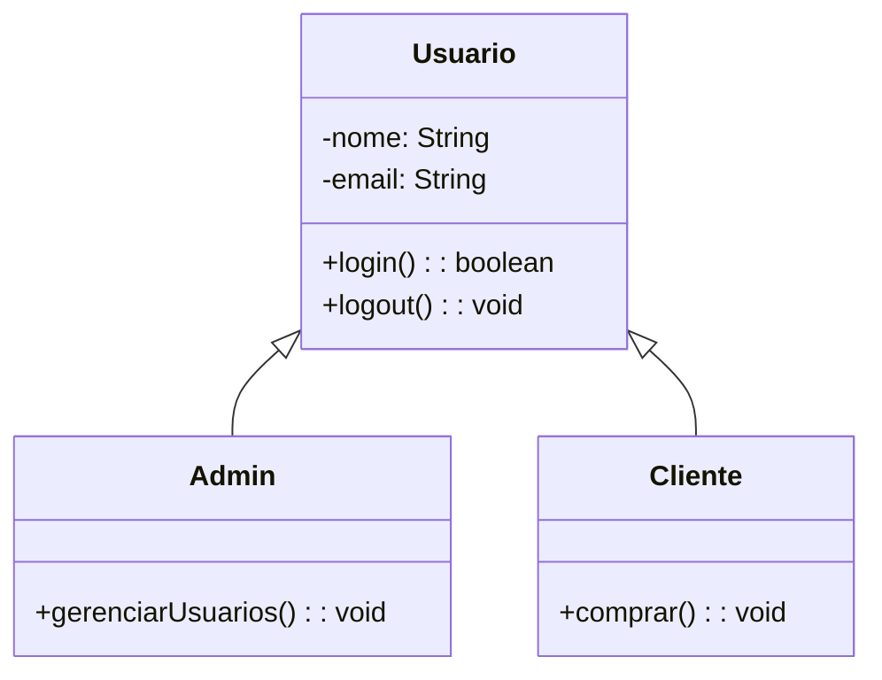
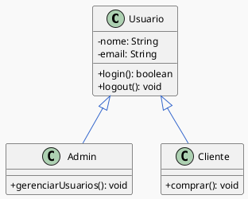
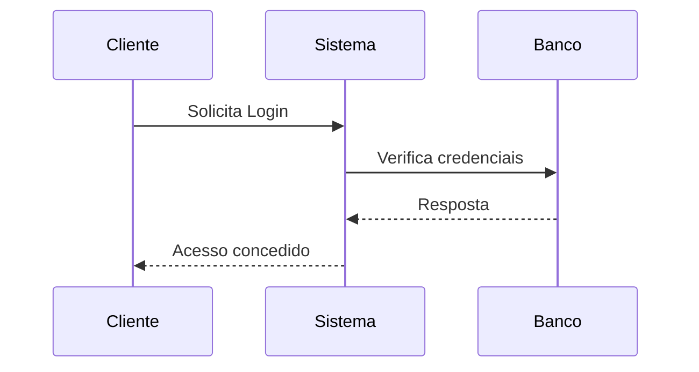
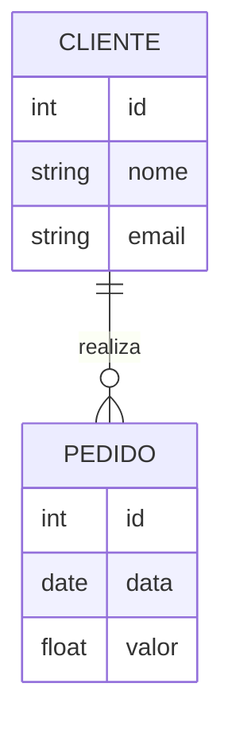
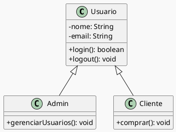
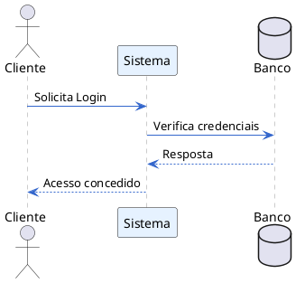
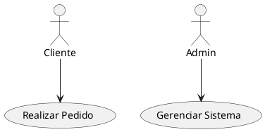
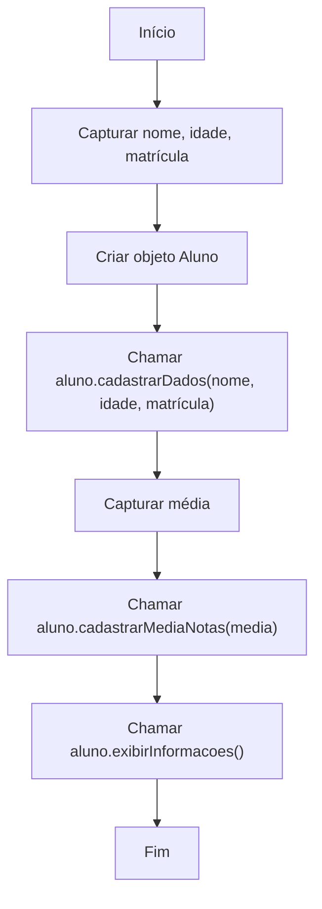
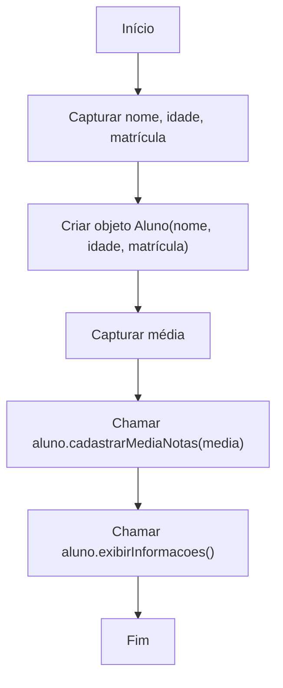

## **1. Comparativo de Plugins**

Comparação direta dos principais formatos e plugins para criar diagramas UML e outros diagramas **direto em Markdown**, levando em conta **suporte no GitHub**, **facilidade de edição** e **capacidade de gerar diagramas como código**.

---


| Ferramenta                  | Tipo                                   | Suporte direto no GitHub Markdown                                          | Sintaxe/Modo de edição                          | Prós                                                                                                               | Contras                                                                                   |
| --------------------------- | -------------------------------------- | -------------------------------------------------------------------------- | ----------------------------------------------- | ------------------------------------------------------------------------------------------------------------------ | ----------------------------------------------------------------------------------------- |
| **Mermaid**                 | Diagrama como código                   | **Sim** (renderiza direto no GitHub)                                       | Texto (blocos \`\`\`mermaid)                    | ✅ Renderiza no GitHub sem extensões<br>✅ Fácil versionamento<br>✅ Ideal para UML simples (classes, seq., ER, etc.) | ❌ Menos opções visuais que Draw\.io/Excalidraw<br>❌ Layout automático nem sempre perfeito |
| **PlantUML**                | Diagrama como código                   | **Não nativo** (precisa converter para PNG/SVG antes ou usar GitHub Pages) | Texto (blocos \`\`\`plantuml)                   | ✅ Extremamente poderoso (todos os tipos UML, temas, integração com código)<br>✅ Suporte avançado a estilos         | ❌ Não renderiza direto no GitHub<br>❌ Requer Java ou servidor PlantUML                    |
| **Draw\.io (diagrams.net)** | Editor visual                          | **Não direto** (precisa exportar para imagem/SVG e inserir no README)      | Arrastar e soltar                               | ✅ Interface visual completa<br>✅ Extensa biblioteca de formas<br>✅ Integração com VS Code/Obsidian                 | ❌ Não é “diagram-as-code” (difícil versionar)<br>❌ Dependência de exportar arquivo        |
| **Excalidraw**              | Editor visual estilo "whiteboard"      | **Não direto** (mesmo caso do Draw\.io)                                    | Arrastar e soltar (foco em estilo à mão livre)  | ✅ Visual bonito, mais “orgânico”<br>✅ Bom para brainstorms e apresentações                                         | ❌ Não é código, exige exportar<br>❌ Layout menos preciso para UML formal                  |
| **Graphviz / DOT**          | Diagrama como código                   | **Não direto** (precisa exportar)                                          | Texto (blocos \`\`\`dot)                        | ✅ Excelente para grafos complexos<br>✅ Integração com CI/CD                                                        | ❌ Sintaxe pouco intuitiva<br>❌ Não renderiza no GitHub sem conversão                      |
| **Kroki.io**                | Serviço web para diagramas como código | **Parcial** (via imagens SVG linkadas)                                     | Suporta Mermaid, PlantUML, Graphviz, BPMN, etc. | ✅ Suporta vários formatos num só lugar<br>✅ Não precisa instalar nada localmente                                   | ❌ Depende de servidor externo                                                             |
| **Markmap**                 | Mapas mentais como código              | **Não nativo** (precisa GitHub Pages ou plugin)                            | Markdown estruturado                            | ✅ Transformar Markdown em mapa mental direto                                                                       | ❌ Pouco suporte no GitHub direto                                                          |

---

## **2. Foco no GitHub Markdown**

No **GitHub** especificamente:

* **✅ Melhor suporte nativo:** **Mermaid** → basta criar um bloco de código:

#````

#````

* **❌ PlantUML** → só funciona direto se você converter para imagem (PNG/SVG) antes de subir, ou usar GitHub Pages + pipeline para renderizar.

---

## **3. Sugestões de uso prático**

| Cenário                                                       | Melhor Ferramenta |
| ------------------------------------------------------------- | ----------------- |
| UML em Markdown no GitHub com visualização imediata           | **Mermaid**       |
| UML completo com todos recursos gráficos, mas render offline  | **PlantUML**      |
| Diagrama visual editável e colaborativo                       | **Draw\.io**      |
| Diagrama com estilo descontraído ou brainstorming             | **Excalidraw**    |
| Vários formatos de diagrama com código e centralização online | **Kroki.io**      |
| Mapas mentais rápidos no Markdown                             | **Markmap**       |

---

## **4. Minha recomendação para Markdown + GitHub**

* Para **documentação técnica diretamente no repositório** → **Mermaid** (suporte nativo + versionamento fácil).
* Para **modelos UML avançados** → **PlantUML** + export para SVG (inserir no Markdown).
* Para **diagrama visual mais polido** → **Draw\.io** (integrado ao VS Code ou Obsidian).
* Para **brainstorms ou fluxos não formais** → **Excalidraw**.

---

Montar **um exemplo do mesmo diagrama UML de classes** escrito **em Mermaid e em PlantUML**, para você ver **lado a lado** como ficaria no GitHub. Isso ajudaria a decidir qual usar no seu fluxo.


 👍
Montar o **mesmo diagrama UML de classes** em **Mermaid** (renderiza direto no GitHub) e **PlantUML** (mais avançado, mas precisa exportar para imagem antes).

O diagrama será este:

* Classe **Usuario** (atributos: nome, email; métodos: login(), logout())
* Classe **Admin** (herda de Usuario; método: gerenciarUsuarios())
* Classe **Cliente** (herda de Usuario; método: comprar())

---

## **1️⃣ Mermaid (suporte nativo no GitHub)**

> Basta colar no seu `README.md`.

#````markdown

#````

---

## **2️⃣ PlantUML (mais completo, mas não renderiza direto no GitHub)**

> Para usar no GitHub, exporte para **PNG/SVG** antes, ou use **Kroki.io** ou **GitHub Pages** para renderizar.

#````markdown



#````

---

## **Comparação rápida**

| Critério                       | Mermaid                                        | PlantUML                                                                      |
| ------------------------------ | ---------------------------------------------- | ----------------------------------------------------------------------------- |
| **Renderiza direto no GitHub** | ✅ Sim                                          | ❌ Não (precisa exportar)                                                      |
| **Sintaxe**                    | Mais simples                                   | Mais detalhada e poderosa                                                     |
| **Customização visual**        | Limitada                                       | Avançada (cores, estilos, temas)                                              |
| **Tipos UML suportados**       | Básicos (classe, sequência, ERD, estado, etc.) | Quase todos (incluindo diagramas de componentes, atividades, pacotes, deploy) |
| **Integração com código**      | Média                                          | Alta (pode gerar diagramas a partir de código-fonte e anotações)              |

---


Vamos separar em dois blocos:

1. **Mermaid** → todos exemplos com **suporte direto no GitHub Markdown**, basta colar no README.
2. **PlantUML** → exemplos mais completos, mas **precisam ser exportados para imagem** antes de inserir no GitHub (ou via GitHub Pages).

---

## **1️⃣ Mermaid – exemplos com suporte direto no GitHub**

> Basta usar blocos \`\`\`mermaid no Markdown e o GitHub renderiza automaticamente.

### **UML de Classes**

#````markdown

#````

---

### **Diagrama de Sequência**

#````markdown

#````

---

### **Diagrama Entidade-Relacionamento (ERD)**

#````markdown

#````

---

## **2️⃣ PlantUML – exemplos mais completos (não renderiza direto no GitHub)**

> Você precisa exportar para **.png** ou **.svg** e inserir no Markdown.
> Ferramentas para converter: [PlantUML Server](https://plantuml.com/), [Kroki.io](https://kroki.io), VS Code plugin.

---

### **UML de Classes com Tema**

#````markdown

#````

---

### **Diagrama de Sequência com Estilo**

#````markdown

#````

---

### **Diagrama de Casos de Uso**

#````markdown

#````

---

📌 **Resumo**

* **Mermaid** → perfeito para diagramas rápidos **direto no GitHub**.
* **PlantUML** → ideal para diagramas UML **complexos e customizados**, mas precisa converter antes.


O erro de "Parse error" acontece porque o Mermaid usa caracteres como parênteses `( )`, pontos `.` e vírgulas `,` para definir a sua própria sintaxe. Quando você os usa diretamente no texto de um nó, ele não consegue interpretar o código corretamente.

Para resolver isso, basta colocar o texto que contém esses caracteres especiais entre **aspas duplas** (`"`).

-----

Objeto Aluno


```mermaid

flowchart TD

A[Start] --> B[Criar objeto Aluno]

B --> C[Capturar nome, idade, matrícula]

C --> D[Chamar aluno.cadastrarDados()]

D --> E[Capturar média]

E --> F[Chamar aluno.cadastrarMediaNotas()]

F --> G[Chamar aluno.exibirInformacoes()]

G --> H[End]

```


### Código Corrigido

Aqui estão os dois exemplos de fluxograma com a sintaxe corrigida.

#### Correção 1: Passando Dados como Argumentos



-----

#### Correção 2: Usando um Construtor



A simples adição de aspas duplas nos nós que continham `()` e `.` resolve o problema de interpretação do código. 

👍

---

### [ricardotecpro.github.io](https://ricardotecpro.github.io/)
