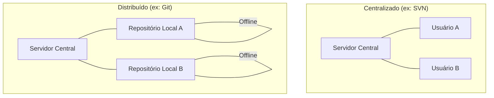

# Aula 01 – O que é Controle de Versão e por que usar Git?

## 🎯 Objetivos de Aprendizagem
- Entender o conceito de Controle de Versão e sua importância no desenvolvimento.
- Diferenciar Git (software) de GitHub (plataforma).
- Compreender a diferença entre sistemas centralizados e distribuídos.
- Conhecer a história e a popularidade do Git no mercado de TI.

---

## 📚 Conteúdo

### 1. O Problema do "Versão Final.doc"
Você já trabalhou em um arquivo importante e acabou criando cópias como `tcc_final.doc`, `tcc_final_v2.doc` ou `tcc_final_IMPRIMIR.doc`? Isso é **controle de versão manual** e é extremamente propenso a falhas: você perde o histórico de quem mudou o quê, quando e por quê.

!!! warning "Atenção"
    O controle manual de arquivos não escala. Em equipes profissionais, perder o rastro de uma alteração pode significar horas de trabalho perdido.

### 2. O que é um Sistema de Controle de Versão (VCS)?
Um **Version Control System (VCS)** é um software que rastreia mudanças em arquivos ao longo do tempo. Ele funciona como uma "Máquina do Tempo" para o seu código.

!!! info "Conceito"
    Um VCS permite que você reverta arquivos para estados anteriores, compare mudanças entre versões e recupere arquivos perdidos acidentalmente.

### 3. Sistemas Centralizados vs. Distribuídos
Existem dois tipos principais de arquitetura para controle de versão:



*   **Centralizado**: Existe um único servidor que guarda o histórico. Se o servidor cair, ninguém consegue trabalhar.
*   **Distribuído**: Cada desenvolvedor possui uma **cópia completa** do histórico em sua máquina. O servidor central serve apenas como ponto de sincronização.

### 4. Git vs GitHub: Não Confunda!
É a dúvida mais comum para quem está começando:

| Característica | Git | GitHub |
| :--- | :--- | :--- |
| **O que é?** | Software de controle de versão (local). | Plataforma de hospedagem na nuvem. |
| **Instalação** | Instalado no seu computador. | Acessado via navegador. |
| **Função** | Gerencia o histórico de arquivos. | Facilita a colaboração e redes sociais. |

!!! tip "Dica"
    Pense no **Git** como o motor (software) e no **GitHub** como a concessionária (onde você guarda e exibe seus carros).

### 5. Verificação Inicial do Ambiente

Antes de começarmos a codar, vamos verificar se você já tem a ferramenta instalada.

<!-- termynal -->
```bash
# Verificando a versão do Git instalada
$ git --version
git version 2.45.0.windows.1

# Verificando se o comando 'git' é reconhecido
$ where git
C:\Program Files\Git\cmd\git.exe
```

---

## 📝 Prática

### Exercícios de Fixação
O conteúdo prático desta aula foca na compreensão teórica e verificação de ambiente.
[:octicons-arrow-right-24: Ver Exercícios da Aula 01](../exercicios/exercicio-01.md)

### Mini-Projeto
Construiremos um **Portfólio Profissional** ao longo deste curso. O primeiro passo é apenas organizativo.
[:octicons-arrow-right-24: Ver Projeto da Aula 01](../projetos/projeto-01.md)
