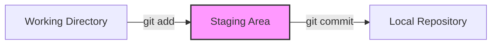

# Aula 03 – Repositórios, Commits e Histórico

## 🎯 Objetivos de Aprendizagem
- Iniciar um repositório Git do zero (`git init`).
- Compreender as três áreas fundamentais do Git: Working Directory, Staging Area e Repository.
- Realizar seu primeiro commit e entender o fluxo de salvamento.
- Visualizar e interpretar o histórico de mudanças (`git log`).
- Utilizar o `git status` como ferramenta constante de diagnóstico.

---

## 📚 Conteúdo

### 1. Inicializando um Repositório
Para que o Git comece a rastrear uma pasta, precisamos "inicializá-la".

!!! info "Comando Mestre"
    O comando `git init` cria uma pasta oculta chamada `.git`. É ali que o Git armazena todo o histórico de versões. **Nunca delete essa pasta**, ou você perderá o histórico do projeto!

<!-- termynal -->
```bash
# Transformando a pasta atual em um repositório
$ git init
Initialized empty Git repository in C:/.../.git/
```

### 2. O Modelo Mental das 3 Áreas
O Git não salva tudo automaticamente. Você precisa decidir o que salvar em um processo de 3 etapas:



1.  **Working Directory**: Onde você cria e edita seus arquivos (sua pasta de projeto).
2.  **Staging Area (Index)**: Uma zona de preparação. Pense nela como uma "caixa" onde você coloca os itens que quer enviar no próximo commit.
3.  **Repository**: O "banco de dados" de versões. Quando você faz um commit, o conteúdo da Staging Area é gravado permanentemente aqui.

### 3. O Fluxo de Trabalho Básico
O ciclo de vida de uma alteração segue sempre este padrão:

!!! tip "Comando de Ouro: git status"
    Use o `git status` o tempo todo! Ele diz em qual área seus arquivos estão e sugere os próximos comandos.

<!-- termynal -->
```bash
# 1. Veja o estado atual
$ git status

# 2. Adicione ao Staging Area (prepair para o commit)
$ git add arquivo.txt

# 3. Grave a versão com uma mensagem explicativa
$ git commit -m "Explicação curta do que foi feito"
```

### 4. Consultando o Passado: git log
Como saber o que foi feito ontem? Ou por quem?

<!-- termynal -->
```bash
$ git log
commit a1b2c3d4... (HEAD -> main)
Author: Ricardo Tec Pro <ricardotecpro@hotmail.com>
Date:   Thu Feb 26 17:15:00 2026 -0300

    Adiciona arquivo sobre mim
```

!!! success "Conceito Chave"
    Um **Commit** é como uma fotografia (snapshot) do seu projeto naquele exato momento. Ele possui um ID único (Hash) que permite voltar no tempo sempre que necessário.

---

## 📝 Prática

### Exercícios de Fixação
Pratique os primeiros comandos em um ambiente seguro.
[:octicons-arrow-right-24: Ver Exercícios da Aula 03](../exercicios/exercicio-03.md)

### Mini-Projeto
Chegou a hora de dar o "primeiro passo" oficial no seu portfólio.
[:octicons-arrow-right-24: Ver Projeto da Aula 03](../projetos/projeto-03.md)
