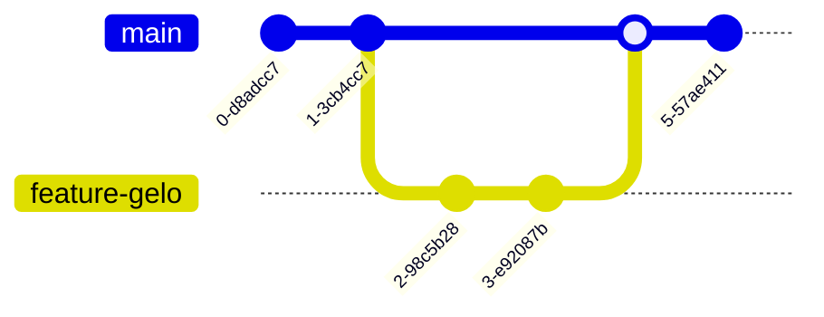

# Aula 04 – Branches e Merges: As Linhas do Tempo

## 🎯 Objetivos de Aprendizagem
- Entender o conceito de Branches (Ramificações) como isolamento de trabalho.
- Criar, listar e navegar entre branches utilizando `git branch` e `git switch`.
- Realizar a fusão de alterações de diferentes linhas do tempo com `git merge`.
- Compreender a segurança de trabalhar em "funcionalidades isoladas".

---

## 📚 Conteúdo

### 1. O Conceito de "Multiverso" no Git
Imagine que você tem um jogo funcional (branch `main`). Você quer testar uma "fase de gelo", mas não quer estragar a versão estável se algo der errado. No Git, você cria um **Branch**.

!!! info "Definição"
    Um branch é um ponteiro móvel para um commit. Ele permite que você saia da linha principal, faça experimentos e depois decida se quer incorporá-los ou descartá-los.

### 2. O Fluxo de Ramificação



### 3. Comandos de Navegação

!!! tip "Cuidado com o Trabalho Sujo"
    Sempre faça commit ou "stash" (veremos adiante) das suas mudanças antes de trocar de branch, para evitar conflitos de arquivos.

<!-- termynal -->
```bash
# Listar todos os branches locais
$ git branch
* main

# Criar um novo branch (ex: para uma nova funcionalidade)
$ git branch feature-contato

# Tocar para o novo branch
$ git switch feature-contato
Switched to branch 'feature-contato'
```

### 4. Unindo Mundos: O Merge
Após terminar o trabalho na sua branch isolada, você deve trazer essas novidades para a branch principal.

<!-- termynal -->
```bash
# 1. Volte para a branch que vai RECEBER as mudanças
$ git switch main

# 2. Execute o merge
$ git merge feature-contato
Updating a1b2c3d..e4f5g6h
Fast-forward
 contato.txt | 1 +
 1 file changed, 1 insertion(+)
 create mode 100644 contato.txt
```

!!! success "Boas Práticas"
    Nunca trabalhe diretamente na `main`. Crie uma branch para cada nova tarefa. Isso mantém o código estável sempre disponível para "produção".

---

## 📝 Prática

### Exercícios de Fixação
Experimente criar e unir diferentes linhas do tempo.
[:octicons-arrow-right-24: Ver Exercícios da Aula 04](../exercicios/exercicio-04.md)

### Mini-Projeto
Adicionando novas funcionalidades ao seu portfólio de forma segura através de branches.
[:octicons-arrow-right-24: Ver Projeto da Aula 04](../projetos/projeto-04.md)
