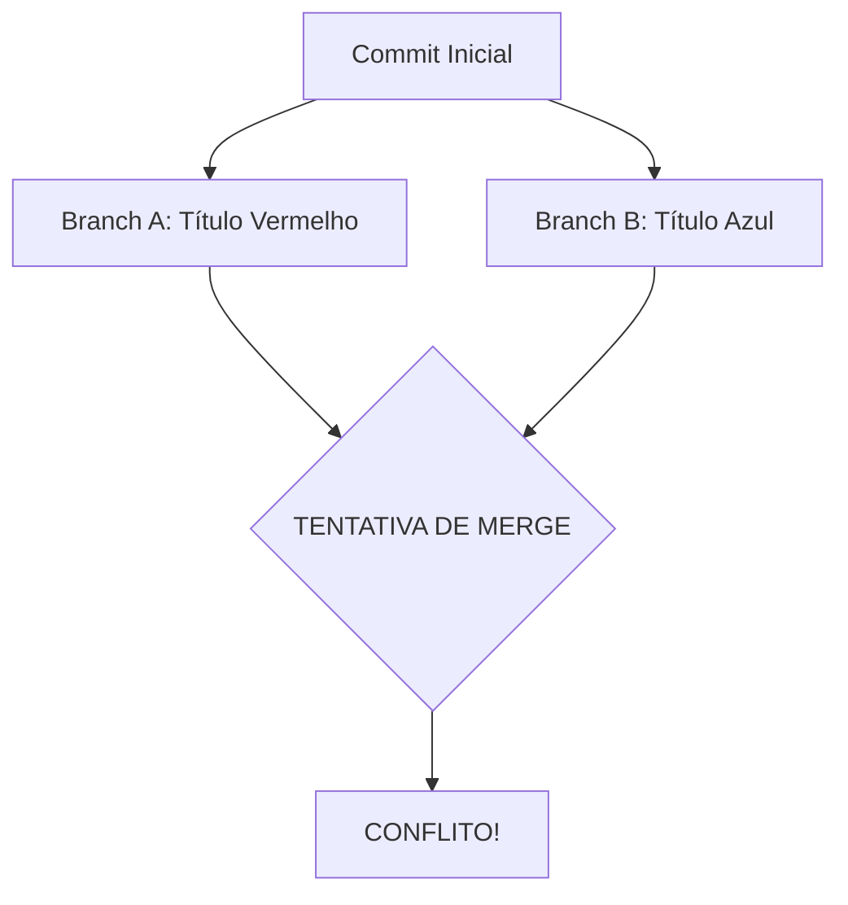

# Aula 05 – Resolução de Conflitos: O Dilema da Escolha

## 🎯 Objetivos de Aprendizagem
- Entender o que é um conflito de merge (Merge Conflict).
- Identificar por que conflitos acontecem e como o Git os detecta.
- Aprender a ler e interpretar os marcadores de conflito (`<<<<<<<`, `=======`, `>>>>>>>`).
- Resolver conflitos manualmente através do terminal ou editor de código.

---

## 📚 Conteúdo

### 1. O que é um Conflito?
O Git é excelente em unir alterações automaticamente. Se você altera o cabeçalho e um colega altera o rodapé, o `git merge` faz o trabalho sozinho. Porém, se ambos alterarem a **mesma linha** de formas diferentes, o Git entra em "segurança": ele para o processo e pergunta: *"Quem está certo?"*.



!!! info "O Conflito é um Recurso"
    O conflito não é um erro do sistema, mas um mecanismo de segurança para evitar que o Git apague o trabalho de alguém sem supervisão humana.

### 2. Anatomia de um Conflito
Quando o conflito acontece, o Git modifica o arquivo e adiciona marcadores visuais.

!!! bug "Identificando Marcadores"
    O arquivo ficará assim até você editá-lo:
    ```text
    <<<<<<< HEAD
    Meu título é Incrível! (Sua versão atual)
    =======
    Este título é Fantástico! (Versão que está chegando)
    >>>>>>> branch-do-colega
    ```

### 3. Como Resolver: O Passo a Passo
A resolução é um processo manual e envolve 3 etapas fundamentais:

<!-- termynal -->
```bash
# 1. Identifique os arquivos com conflito
$ git status
both modified:   arquivo.txt

# 2. Abra o arquivo no seu editor, escolha a versão final e APAGUE os marcadores (<<<<, ====, >>>>)

# 3. Marque como resolvido
$ git add arquivo.txt

# 4. Finalize o merge
$ git commit
```

!!! tip "Dica de Ouro"
    Muitas vezes, a melhor solução não é escolher uma ou outra versão, mas sim criar uma terceira versão que combine as ideias de ambas as partes. Comunique-se com seu time!

---

## 📝 Prática

### Exercícios de Fixação
Enfrente seu primeiro conflito em um ambiente controlado e seguro.
[:octicons-arrow-right-24: Ver Exercícios da Aula 05](../exercicios/exercicio-05.md)

### Mini-Projeto
Simulando um conflito no seu portfólio para dominar a resolução manual.
[:octicons-arrow-right-24: Ver Projeto da Aula 05](../projetos/projeto-05.md)
