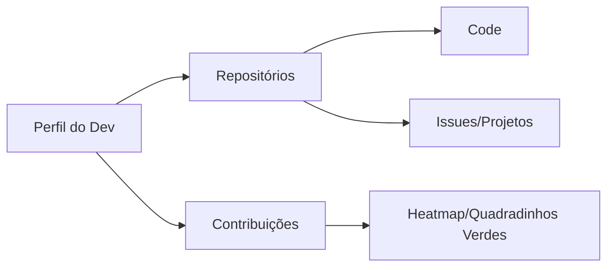

# Aula 06 – Introdução ao GitHub: Sua Casa na Nuvem

## 🎯 Objetivos de Aprendizagem
- Navegar pela interface do GitHub e entender suas seções principais.
- Configurar um perfil profissional atrativo para recrutadores.
- Entender conceitos sociais: Stars, Forks, Watch e Issues.
- Diferenciar repositórios públicos de privados.

---

## 📚 Conteúdo

### 1. O GitHub como seu Currículo Vivo
Diferente de um currículo em papel, o GitHub prova o que você sabe fazer através do código real.

!!! success "O Heatmap"
    O gráfico de contribuições é um dos primeiros lugares onde recrutadores olham. Ele demonstra consistência e hábito de estudo.

### 2. Conceitos de Interação Social
O GitHub funciona como uma rede social para desenvolvedores. Domine estas ferramentas:

*   **Star (Estrela)**: Salva o repositório como um favorito. Ajuda o projeto a ganhar visibilidade.
*   **Watch (Observar)**: Deixa você "inscrito" no repositório para receber notificações de mudanças.
*   **Fork (Bifurcação)**: Cria uma cópia exata do repositório de outra pessoa na sua conta. É o primeiro passo para contribuir com projetos famosos.

### 3. Gestão com Issues
Issues são muito mais do que "erros". Elas são a ferramenta oficial de gestão do GitHub.

!!! info "Para que usar Issues?"
    - Relatar bugs (erros no código).
    - Sugerir novas funcionalidades.
    - Discutir ideias com outros desenvolvedores.
    - Organizar sua própria lista de tarefas (To-Do list).

### 4. Segurança e Profissionalismo

!!! warning "Segurança: 2FA"
    Ative sempre a Autenticação de Dois Fatores (2FA) em sua conta. O GitHub é um alvo comum para hackers devido ao valor do código hospedado.

!!! tip "Dica Profissional"
    Mantenha sua Bio curta e direta. Use uma foto clara e amigável. Fixe (Pin) seus melhores projetos no topo do seu perfil para causar uma boa primeira impressão.

---

## 📝 Prática

### Exercícios de Fixação
Explore a interface e personalize seu perfil para o mercado.
[:octicons-arrow-right-24: Ver Exercícios da Aula 06](../exercicios/exercicio-06.md)

### Mini-Projeto
Preparação mental para a grande subida: na próxima aula, seu código ganha o mundo!
[:octicons-arrow-right-24: Ver Projeto da Aula 06](../projetos/projeto-06.md)
