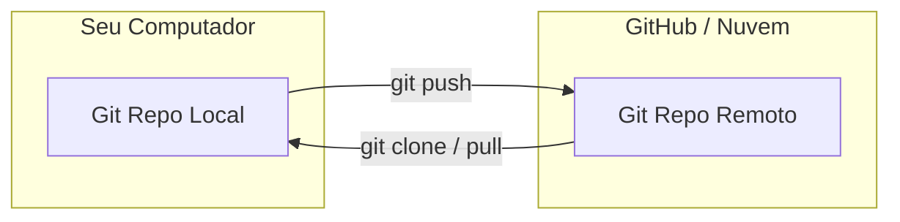

# Aula 07 – Repositórios Remotos: Conectando-se ao Mundo

## 🎯 Objetivos de Aprendizagem
- Criar um novo repositório no GitHub para hospedar seu código na nuvem.
- Conectar um repositório local a um remoto utilizando `git remote add`.
- Realizar o envio de alterações para o servidor através do `git push`.
- Baixar e colaborar em projetos existentes utilizando o `git clone`.
- Compreender a função vital do arquivo `.gitignore`.

---

## 📚 Conteúdo

### 1. O Conceito de Repositório Remoto
Até agora, seu trabalho vive apenas no seu computador. Para colaborar ou ter um backup seguro, usamos um **Remote**.



### 2. Conectando Local e Remoto
O primeiro passo é dizer ao seu Git local onde está o "balde" na nuvem.

!!! info "O Apelido 'origin'"
    `origin` é apenas uma convenção. É o nome padrão que damos ao repositório principal no servidor.

<!-- termynal -->
```bash
# Adiciona um vínculo remoto (troque pela URL do seu repo)
$ git remote add origin https://github.com/usuario/projeto.git

# Verifica se o vínculo foi criado com sucesso
$ git remote -v
origin  https://github.com/usuario/projeto.git (fetch)
origin  https://github.com/usuario/projeto.git (push)
```

### 3. Enviando e Baixando Código
*   **Push**: "Empurra" seus commits para o servidor.
*   **Clone**: Cria uma cópia local completa de um repositório remoto pela primeira vez.

!!! tip "Upstream (-u)"
    Ao usar `git push -u origin main` pela primeira vez, você vincula as branches. No futuro, bastará digitar apenas `git push`.

<!-- termynal -->
```bash
# Enviando para a branch principal
$ git push -u origin main

# Clonando um projeto de outra pessoa
$ git clone https://github.com/outra-pessoa/projeto-legal.git
```

### 4. O Arquivo .gitignore
Nem tudo deve ir para o GitHub! Arquivos de configuração pessoal, senhas (`.env`), pastas de dependências gigantes (`node_modules`) ou arquivos temporários devem ser ignorados.

!!! warning "Segurança"
    Nunca coloque chaves de API ou senhas em repositórios públicos. Use o `.gitignore` para prevenir acidentes!

**Exemplo de `.gitignore`:**
```text
.env
node_modules/
*.log
.DS_Store
```

---

## 📝 Prática

### Exercícios de Fixação
Pratique a conexão entre seu computador e a nuvem.
[:octicons-arrow-right-24: Ver Exercícios da Aula 07](../exercicios/exercicio-07.md)

### Mini-Projeto
Momento épico: suba seu portfólio para o GitHub e torne-o público!
[:octicons-arrow-right-24: Ver Projeto da Aula 07](../projetos/projeto-07.md)
