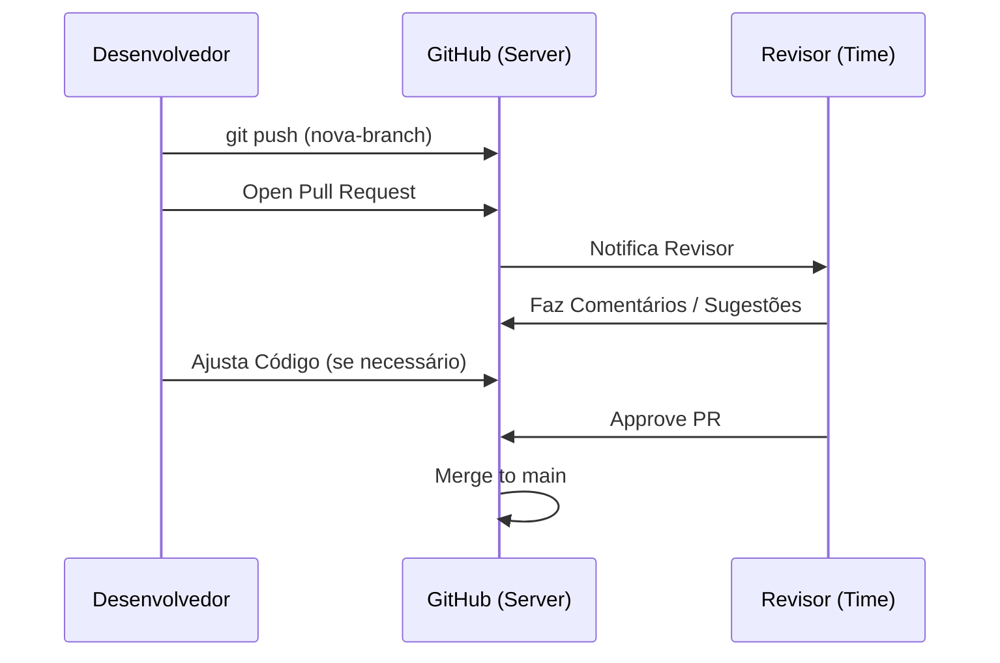

# Aula 08 – Pull Requests e Code Review: O Coração da Colaboração

## 🎯 Objetivos de Aprendizagem
- Entender o fluxo de Pull Request (PR) como pedido de inclusão de código.
- Aprender como sugerir mudanças em projetos de forma organizada.
- Realizar um Code Review básico focado em qualidade e aprendizado.
- Finalizar (Merge) um PR através da interface do GitHub.

---

## 📚 Conteúdo

### 1. O que é um Pull Request (PR)?
Se você trabalha em branches isoladas, como avisa sua equipe que sua tarefa está pronta para entrar na branch principal (`main`)? Você cria um **Pull Request**.

!!! info "Tradução"
    Pull Request significa, literalmente, "Pedido de Puxada". Você está pedindo para os administradores do projeto "puxarem" suas alterações para o código oficial.

### 2. O Ciclo de Vida do PR

### 3. Code Review (Revisão de Código)
É a prática de ler o código de outra pessoa antes de aceitá-lo.

!!! success "Benefícios do Review"
    - **Qualidade**: Encontra bugs antes que cheguem ao usuário final.
    - **Aprendizado**: O time discute melhores formas de resolver problemas.
    - **Padrão**: Mantém o código do projeto uniforme e legível.

!!! tip "Ética no Review"
    Lembre-se: você está revisando o **código**, não a pessoa. Seja educado, construtivo e elogie boas soluções!

### 4. Merge via Interface do GitHub
Diferente do merge local, o merge de um PR acontece no servidor do GitHub através de um botão. Após o merge, todos os outros desenvolvedores devem fazer um `git pull` localmente para receberem as novidades.

---

## 📝 Prática

### Exercícios de Fixação
Simule a abertura e a revisão de um pedido de alteração.
[:octicons-arrow-right-24: Ver Exercícios da Aula 08](../exercicios/exercicio-08.md)

### Mini-Projeto
Integrando novas melhorias ao seu portfólio seguindo o fluxo profissional de PR.
[:octicons-arrow-right-24: Ver Projeto da Aula 08](../projetos/projeto-08.md)
