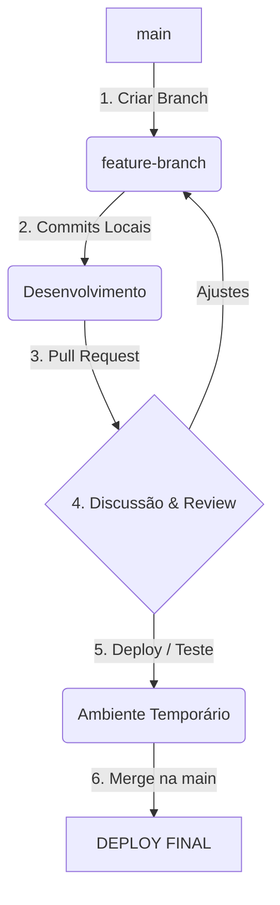

# Aula 09 – Fluxo de Trabalho: GitHub Flow

## 🎯 Objetivos de Aprendizagem
- Entender a importância de seguir um fluxo de trabalho (workflow) padronizado.
- Aprender o **GitHub Flow**: um modelo ágil, leve e focado em entrega contínua.
- Diferenciar o GitHub Flow de modelos mais complexos como o Git Flow.
- Compreender o ciclo completo: Branch -> Commit -> PR -> Deploy -> Merge.

---

## 📚 Conteúdo

### 1. O que é um Workflow?
Um workflow é um conjunto de regras que a equipe combina para evitar o caos. Sem regras, o repositório se torna uma bagunça de códigos inacabados.

!!! info "A Regra de Ouro"
    No GitHub Flow, a branch `main` é **sagrada**. Ela deve estar sempre estável e pronta para ser enviada para produção a qualquer momento.

### 2. Os 6 Passos do GitHub Flow
Este é o fluxo utilizado pelas empresas de tecnologia mais modernas do mundo:



### 3. Por que o GitHub Flow?
Diferente do **Git Flow** (modelo mais antigo e complexo), o GitHub Flow foca na velocidade.

| Característica | GitHub Flow | Git Flow |
| :--- | :--- | :--- |
| **Complexidade** | Baixa (Leve) | Alta (Muitas branches) |
| **Velocidade** | Entrega Contínua | Lançamentos Agendados |
| **Ideal para** | Web, SaaS, Apps | Softwares de prateleira (OS) |

### 4. Executando o Fluxo no Terminal

!!! tip "Crie Branches Descritivas"
    Evite nomes como `branch1`. Use `ajusta-bug-login` ou `adiciona-secao-contato`.

<!-- termynal -->
```bash
# 1. Certifique-se de estar na main e atualizado
$ git switch main
$ git pull

# 2. Crie e mude para a nova branch em um só comando
$ git switch -c feature-nova-sessao

# 3. Trabalhe, adicione e commite
$ git add .
$ git commit -m "Adiciona nova seção de biografia"

# 4. Envie para o GitHub para abrir o PR
$ git push origin feature-nova-sessao
```

---

## 📝 Prática

### Exercícios de Fixação
Desenhe e simule o fluxo completo do GitHub Flow em sua máquina.
[:octicons-arrow-right-24: Ver Exercícios da Aula 09](../exercicios/exercicio-09.md)

### Mini-Projeto
Aplicando o GitHub Flow para evoluir seu portfólio de forma profissional.
[:octicons-arrow-right-24: Ver Projeto da Aula 09](../projetos/projeto-09.md)
