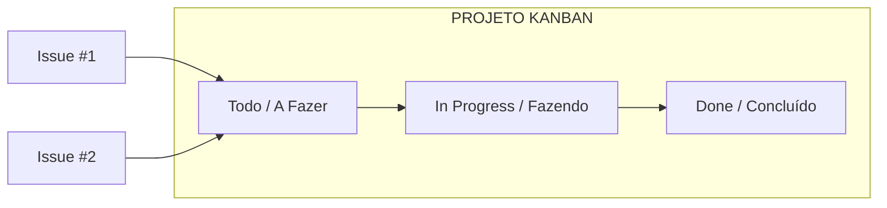

# Aula 10 – Issues e Projetos: Organizando o Caos

## 🎯 Objetivos de Aprendizagem
- Aprender a registrar e organizar tarefas de forma profissional com **Issues**.
- Utilizar **Labels**, **Assignees** e **Milestones** para classificar e priorizar o trabalho.
- Gerenciar o fluxo de trabalho visualmente através do **GitHub Projects** (Kanban).
- Compreender a automação de fechar Issues através de Pull Requests.

---

## 📚 Conteúdo

### 1. Issues: A Unidade Atômica de Trabalho
No GitHub, uma "Issue" (Questão/Problema) é utilizada para registrar qualquer tipo de trabalho necessário em um repositório.

!!! info "Tipos Comuns de Issues"
    - **Bug**: Erro no código que precisa de correção.
    - **Feature**: Nova funcionalidade a ser desenvolvida.
    - **Enhancement**: Melhoria em algo que já existe.
    - **Task**: Tarefas administrativas ou de documentação.

### 2. Gestão Visual com GitHub Projects
Trabalhar em uma lista infinita de Issues é desmotivador. Por isso, usamos o **GitHub Projects** para transformar essas tarefas em um quadro Kanban.



### 3. Anatomia de uma Issue Profissional
Para que uma Issue seja útil, ela deve conter:
- **Title**: Curto e objetivo.
- **Assignees**: Quem é o responsável pela entrega?
- **Labels**: Etiquetas coloridas para filtro rápido (ex: `bug`, `documentation`).
- **Milestones**: "Marcos" que agrupam issues por data de entrega (ex: `Versão 1.0`).

### 4. Automação: O Truque do "Closes"
Você pode economizar tempo conectando seu código à sua tarefa.

!!! tip "Automação de Fechamento"
    Se você escrever `Closes #10` (onde 10 é o número da issue) na descrição do seu Pull Request, o GitHub **fechará automaticamente** a Issue assim que o merge for aprovado.

<!-- termynal -->
```bash
# Exemplo de mensagem de commit ou descrição de PR
$ git commit -m "Refatora login e closes #45"
```

---

## 📝 Prática

### Exercícios de Fixação
Crie, categorize e organize suas primeiras tarefas no GitHub.
[:octicons-arrow-right-24: Ver Exercícios da Aula 10](../exercicios/exercicio-10.md)

### Mini-Projeto
Construindo o "Roadmap" (Mapa de Futuro) para o seu portfólio profissional.
[:octicons-arrow-right-24: Ver Projeto da Aula 10](../projetos/projeto-10.md)
