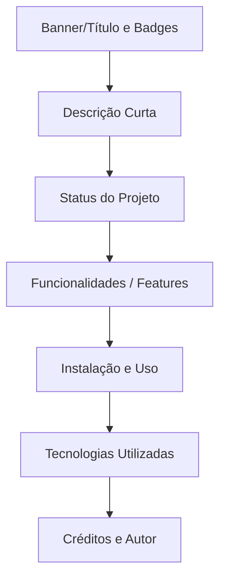

# Aula 12 – Documentação: README Profissional e Markdown

## 🎯 Objetivos de Aprendizagem
- Entender por que o `README.md` é o seu cartão de visitas para o mundo.
- Aprender a sintaxe fundamental do **Markdown** para formatar textos.
- Estruturar documentações atraentes e organizadas para repositórios.
- Integrar mídias, badges e emojis para uma interface mais rica.

---

## 📚 Conteúdo

### 1. O Cartão de Visitas do seu Código
Quando um recrutador ou outro desenvolvedor abre seu repositório, o arquivo `README.md` é a primeira coisa que ele vê. Se estiver vazio ou bagunçado, o projeto inteiro será julgado da mesma forma.

!!! important "O que um bom README deve responder?"
    - **O que é este projeto?** (Contexto)
    - **Para que serve?** (Problema resolvido)
    - **Como eu rodo isso na minha máquina?** (Instrução)

### 2. Markdown: Simples e Poderoso
O Markdown (`.md`) é uma linguagem de marcação leve que permite formatar texto de maneira rápida.

| Elemento | Sintaxe | Resultado |
| :--- | :--- | :--- |
| Títulos | `# H1` até `###### H6` | Cabeçalhos de vários tamanhos. |
| Negrito | `**Texto**` | **Texto** |
| Links | `[Nome](URL)` | `[Nome](URL)` |
| Código | `inline` ou ` ```bloco``` ` | Formatação monospace. |
| Itens | `- Item` ou `* Item` | Listas com marcadores. |

### 3. Estrutura de Documentação "Gold Standard"
Um repositório profissional geralmente segue esta ordem:



### 4. Dicas Visuais: Badges e Emojis
Use emojis para dar tom e personalidade (ex: :rocket:, :bug:). Use Badges (escudos decorativos) via [Shields.io](https://shields.io) para mostrar a versão do projeto, linguagens usadas ou se os testes estão passando.

!!! success "Exemplo de Badge"
    

---

## 📝 Prática

### Exercícios de Fixação
Domine a sintaxe do Markdown e crie documentos formatados.
[:octicons-arrow-right-24: Ver Exercícios da Aula 12](../exercicios/exercicio-12.md)

### Mini-Projeto
Transformando seu portfólio de um simples arquivo de texto em uma vitrine profissional.
[:octicons-arrow-right-24: Ver Projeto da Aula 12](../projetos/projeto-12.md)
