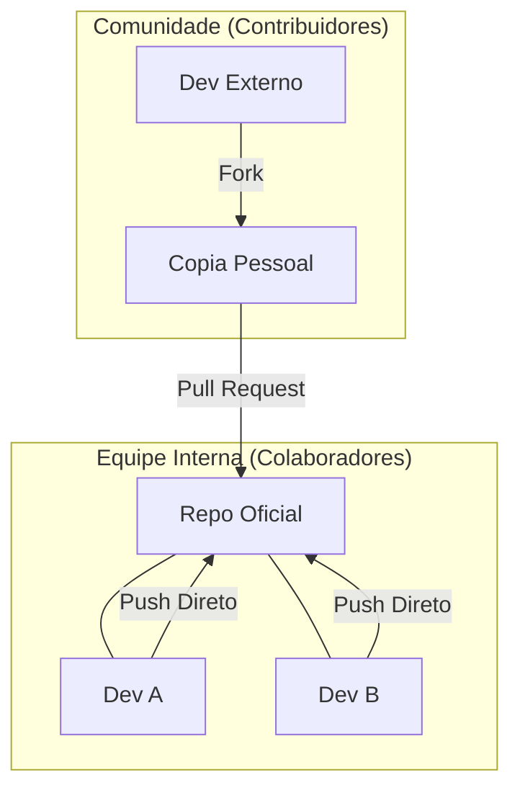

# Aula 13 – Trabalho em Equipe: Colaboração Profissional

## 🎯 Objetivos de Aprendizagem
- Entender os níveis de permissão no GitHub (Read, Write, Admin).
- Adicionar colaboradores a um repositório privado ou público.
- Compreender a diferença entre Colaborador (Interno) e Contribuidor (Comunidade/Fork).
- Simular um fluxo de trabalho em equipe e gerenciar o "Push Rejeitado".

---

## 📚 Conteúdo

### 1. Níveis de Permissão no GitHub
Por padrão, apenas o dono (Owner) pode alterar um repositório. Para trabalhar em grupo, você deve conceder acessos específicos:

*   **Read**: Pode ler o código e abrir Issues.
*   **Write**: Pode criar branches e dar `push` direto (Colaborador).
*   **Admin**: Pode gerenciar configurações e deletar o repositório.

### 2. Colaborador vs Contribuidor
Existem duas formas principais de contribuir para um projeto no GitHub:



### 3. A Regra de Ouro: Pull antes do Push
Quando você trabalha em equipe, o servidor pode ter commits que você ainda não tem na sua máquina. Se você tentar enviar (`push`) seu trabalho sem estar atualizado, o Git recusará.

!!! failure "Erro Comum: Updates Rejeitados"
    O Git impede o `push` para evitar que você apague acidentalmente o trabalho do seu colega que já está no servidor.

<!-- termynal -->
```bash
# Sincronize sempre seu código antes de começar a trabalhar
$ git pull origin main
From https://github.com/usuario/projeto
 * branch            main       -> FETCH_HEAD
Already up to date.
```

### 4. Gestão de Membros
Para adicionar alguém ao seu time:
1. Vá em **Settings** no repositório.
2. Acesse **Collaborators**.
3. Clique em **Add people** e digite o usuário ou e-mail.

!!! tip "Dica Profissional"
    Nunca dependa de uma única pessoa para ter permissão de Admin. Em projetos de empresa, garanta que pelo menos dois desenvolvedores seniores tenham acesso total para evitar bloqueios.

---

## 📝 Prática

### Exercícios de Fixação
Simule a entrada de um colega no projeto e aprenda a lidar com repositórios compartilhados.
[:octicons-arrow-right-24: Ver Exercícios da Aula 13](../exercicios/exercicio-13.md)

### Mini-Projeto
Preparando seu portfólio para receber contribuições e exibir colaboradores.
[:octicons-arrow-right-24: Ver Projeto da Aula 13](../projetos/projeto-13.md)
