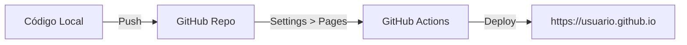

# Aula 14 – GitHub Pages: Seu Portfólio Online

## 🎯 Objetivos de Aprendizagem
- Entender o conceito de hospedagem gratuita com o **GitHub Pages**.
- Transformar um repositório de código em um site acessível por qualquer pessoa.
- Compreender as limitações técnicas de sites estáticos.
- Publicar seu projeto de Portfólio na web.

---

## 📚 Conteúdo

### 1. Do Código à Web
Até agora, seu projeto vive apenas em pastas. O **GitHub Pages** é o serviço que permite "ligar" seus arquivos HTML, CSS e JS em um endereço real (URL).

### 2. O que é um Site Estático?
O GitHub Pages é focado em performance e segurança, por isso ele suporta apenas conteúdo estático.

| ✅ Suportado (Static) | ❌ Não Suportado (Dynamic/Backend) |
| :--- | :--- |
| HTML5 / CSS3 / JavaScript | PHP / Python (Django/Flask) |
| Frameworks (React, Vue, Vite) | Node.js (Servidor) |
| Imagens / Vídeos / SVGs | Bancos de Dados (MySQL, MongoDB) |

!!! info "Endereço Padrão"
    Seu site ficará disponível no formato: `https://SEU-USUARIO.github.io/NOME-DO-REPO/`.

### 3. Requisito Vital: index.html
O servidor do GitHub busca automaticamente por um arquivo chamado `index.html` na raiz do seu projeto. Se ele não existir, seu site não carregará corretamente.

!!! warning "Atenção ao Case-Sensitive"
    O nome do arquivo deve ser exatamente `index.html` (minúsculo). Em servidores Linux (como os do GitHub), `Index.html` ou `INDEX.HTML` são arquivos diferentes e podem causar erro 404.

### 4. Limites de Uso
O serviço é generoso, mas possui limites para evitar abusos:
- **Tamanho do Site**: Recomendado até 1GB.
- **Largura de Banda**: 100GB por mês.
- **Builds**: Limite de 10 deploys por hora.

!!! tip "Dica de Sucesso"
    Use o GitHub Pages para hospedar documentações de seus projetos, landing pages e, claro, seu portfólio de desenvolvedor. É a vitrine oficial do seu trabalho!

---

## 📝 Prática

### Exercícios de Fixação
Ative seu primeiro site gratuito e teste a visualização em diferentes dispositivos.
[:octicons-arrow-right-24: Ver Exercícios da Aula 14](../exercicios/exercicio-14.md)

### Mini-Projeto
Publicando a versão final do seu portfólio para o mundo ver.
[:octicons-arrow-right-24: Ver Projeto da Aula 14](../projetos/projeto-14.md)
