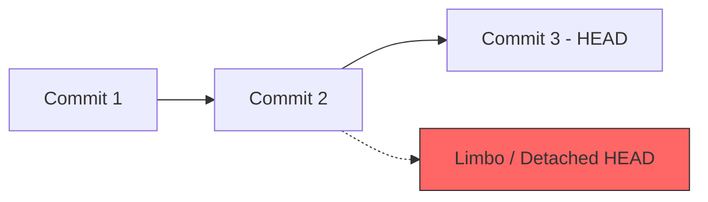

# Aula 15 – Troubleshooting: Erros Comuns e Soluções

## 🎯 Objetivos de Aprendizagem
- Identificar e corrigir os erros mais frequentes do dia a dia no Git.
- Entender o estado de **Detached HEAD** e como sair dele com segurança.
- Resolver situações de commits feitos na branch errada usando `git reset`.
- Recuperar arquivos deletados acidentalmente através do `git restore`.

---

## 📚 Conteúdo

### 1. Socorro, o Push foi Rejeitado!
O erro `! [rejected] main -> main (fetch first)` acontece porque há commits no servidor que você não tem localmente.

!!! success "Solução"
    Basta sincronizar seu repositório local antes de tentar enviar novamente:
    <!-- termynal -->
    ```bash
    $ git pull origin main
    # Resolva conflitos se surgirem, e então:
    $ git push origin main
    ```

### 2. Desfazendo Commits com Reset
Errou a mensagem ou o conteúdo do último commit? O `reset` é sua ferramenta.

| Tipo de Reset | Comando | Resultado |
| :--- | :--- | :--- |
| **Soft** | `git reset --soft HEAD~1` | Desfaz o commit, mas mantém os arquivos no Stage (prontos para novo commit). |
| **Mixed** | `git reset HEAD~1` | Desfaz o commit e tira do Stage, mas mantém as alterações nos arquivos. |
| **Hard** | `git reset --hard HEAD~1` | **Apaga tudo!** Volta ao estado do commit anterior e deleta seu trabalho atual. |

!!! danger "Cuidado com o --hard"
    O `reset --hard` é destrutivo. Use-o apenas se tiver certeza absoluta de que quer jogar seu trabalho atual fora.

### 3. Detached HEAD: O Limbo do Git
Acontece quando você faz checkout em um commit específico (`hash`) em vez de uma branch. Você "viaja no tempo", mas não está em nenhuma linha ativa.



!!! tip "Como sair do Limbo"
    - Para descartar o que viu e voltar ao normal: `git switch main`.
    - Para salvar o que fez no limbo em uma nova branch: `git switch -c nova-branch-com-correcoes`.

### 4. Recuperei, e agora? (git restore)
Deletou um arquivo sem querer? O Git registrou a existência dele no último commit.

<!-- termynal -->
```bash
# Traz o arquivo de volta do último commit para sua pasta
$ git restore arquivo.txt
```

---

## 📝 Prática

### Exercícios de Fixação
Simule erros propositais e aprenda a consertá-los sem pânico.
[:octicons-arrow-right-24: Ver Exercícios da Aula 15](../exercicios/exercicio-15.md)

### Mini-Projeto
Limpando e organizando seu portfólio após correções de emergência e simulações de erros.
[:octicons-arrow-right-24: Ver Projeto da Aula 15](../projetos/projeto-15.md)
