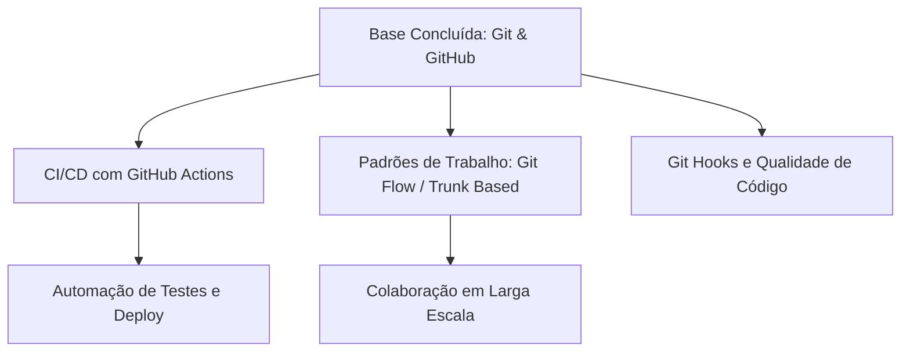

# Aula 16 – Carreira, Portfólio e Próximos Passos

## 🎯 Objetivos de Aprendizagem
- Entender como o GitHub impulsiona sua visibilidade no mercado de trabalho.
- Aprender os primeiros passos para contribuir com projetos Open Source.
- Conhecer conceitos avançados para continuar seus estudos (CI/CD, Actions, Hooks).
- Revisão geral das competências adquiridas durante o curso.

---

## 📚 Conteúdo

### 1. Sua Marca Profissional no GitHub
O GitHub é muito mais do que um repositório; é o seu currículo técnico em tempo real. Recrutadores buscam três pilares:

*   **Consistência**: O "paredão verde" (heatmap) demonstra hábito e disciplina de estudo.
*   **Qualidade**: READMEs bem escritos, código limpo e histórico de commits organizado (Conventional Commits).
*   **Curadoria**: O uso de "Pinned Repositories" para destacar seus melhores trabalhos no topo do perfil.

!!! tip "Dica de Ouro"
    Fixe (Pin) no máximo 6 repositórios. Escolha aqueles que você tem orgulho de explicar em uma entrevista técnica.

### 2. O Mundo do Open Source
Software de código aberto move o mundo. Contribuir para projetos famosos é uma das melhores formas de aprender.

*   **good first issue**: Label usada para marcar tarefas ideais para quem está começando.
*   **Hacktoberfest**: Evento anual que incentiva a primeira contribuição.

### 3. Próximos Passos: O Mapa de Evolução
Você dominou a base sólida. Veja o que o espera no nível intermediário/avançado:

### 4. Checklist do Desenvolvedor Profissional
Sempre que iniciar um novo projeto, lembre-se:
1. [:octicons-check-circle-24:] Criar um `.gitignore` adequado.
2. [:octicons-check-circle-24:] Seguir o **GitHub Flow** (sempre usar branches).
3. [:octicons-check-circle-24:] Escrever mensagens no padrão **Conventional Commits**.
4. [:octicons-check-circle-24:] Criar um `README.md` "Gold Standard".
5. [:octicons-check-circle-24:] Revisar o código (Code Review) mesmo trabalhando sozinho.

---

## 📝 Prática

### Exercícios de Fixação
Faça a faxina final em seu perfil e prepare-se para ser descoberto pelo mercado.
[:octicons-arrow-right-24: Ver Exercícios da Aula 16](../exercicios/exercicio-16.md)

### Mini-Projeto
Finalizando seu Roadmap de estudos e conectando seu portfólio aos seus objetivos de carreira.
[:octicons-arrow-right-24: Ver Projeto da Aula 16](../projetos/projeto-16.md)
