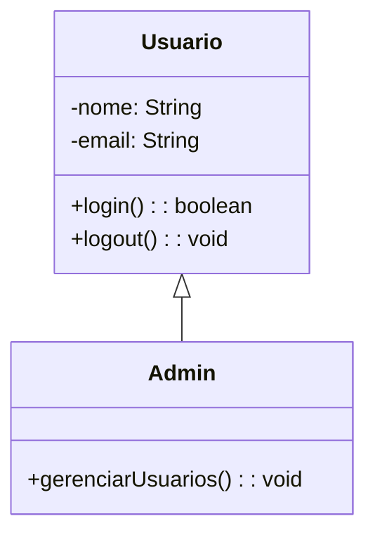

# 🖼 Exemplos

## 1. Mermaid - Diagrama de Classes

```mermaid
classDiagram
    class Usuario {
        -nome: String
        -email: String
        +login(): boolean
        +logout(): void
    }

    class Admin {
        +gerenciarUsuarios(): void
    }

    Usuario <|-- Admin
```

---

## 2. Kroki + PlantUML (embed via imagem SVG)

> O link acima foi gerado com um diagrama simples no [Kroki.io](https://kroki.io)
