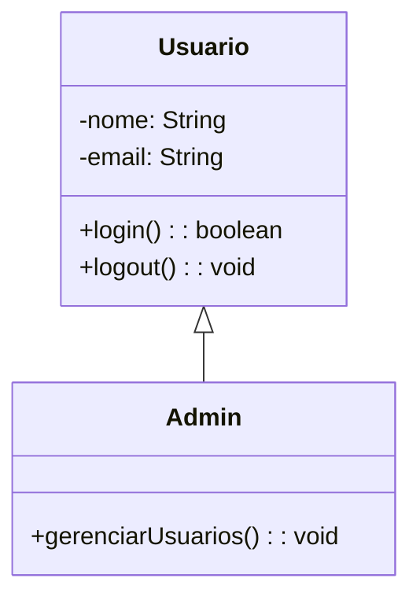

# 🖼 Diagrama Mermaid de Classes

```mermaid
classDiagram
    class Usuario {
        -nome: String
        -email: String
        +login(): boolean
        +logout(): void
    }

    class Admin {
        +gerenciarUsuarios(): void
    }

    Usuario <|-- Admin
```
